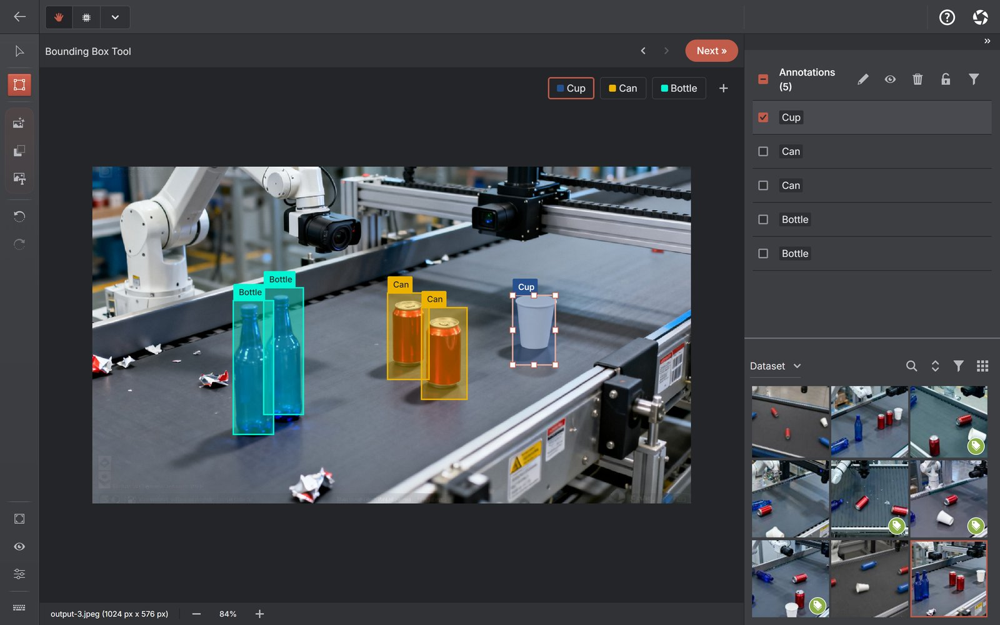

# AnnotateIt Community

**Public support, issue tracker and roadmap for AnnotateIt AI, a local-first image and video annotation app.**

**[Download](https://annotateit.ai/download/)** ·
**[Documentation](https://annotateit.ai/docs/)** ·
**[Issues](https://github.com/AnnotateIt-AI/annotateit-community/issues)** ·
**[Roadmap](ROADMAP.md)** ·
[Open the web app](https://app.annotateit.ai/) ·
[Website](https://annotateit.ai/)

## What AnnotateIt is

AnnotateIt is a proprietary desktop, web and mobile app for building computer-vision datasets. You import images or video, label them for object detection, instance segmentation, keypoints or classification, review the results and export standard formats such as YOLO, COCO and Pascal VOC. Projects, media, labels and annotations are stored on your device, without an AnnotateIt account.

The app is currently free on Web, Windows, macOS, iPhone and iPad, with no project limit. See [pricing](https://annotateit.ai/pricing/) for current details.

**This repository does not contain the application source code.** It holds public support material: issue forms, the roadmap, a changelog pointer and community documents.

## Quick start on Windows: detection boxes to a YOLO export

1. **Install.** Get the free Windows 10/11 build from the [Microsoft Store](https://apps.microsoft.com/detail/9N640T6RLT89) (also linked from the [download page](https://annotateit.ai/download/)). The default AI engines are bundled, so no model download is needed for the core workflow.
2. **Create a project.** Select **Create new project**, choose **Object Detection** and add your labels, for example `car` and `person`.
3. **Import images.** Open the project's dataset and use **Upload media**, or drag your images into it. Check that every intended file arrived.
4. **Annotate and review.** Open an image, pick a label and draw boxes with the **Bounding Box** tool; moving to the next image saves your work. If you pre-label with **Auto-annotate** and a local model, the results wait under the **Pending AI review** filter and stay out of exports until you accept them. Check every image, including those where a model found nothing.
5. **Export YOLO.** Open **Export dataset**, choose **YOLO**, include the images and, if you saved train/validation/test splits, enable split export. Extract the ZIP and check the class order and a few image/label pairs before training.

Keep a restorable backup with **Export project**; a YOLO export is not a full project backup. More detail: [getting started](https://annotateit.ai/docs/getting-started/), [local auto-annotation](https://annotateit.ai/docs/auto-annotation/), [YOLO export layouts](https://annotateit.ai/docs/yolo-format-compatibility/) and [project backup](https://annotateit.ai/docs/project-backup/).

No install? The same workflow runs in the [web app](https://app.annotateit.ai/), or try a ready-made [demo project](https://app.annotateit.ai/demos) first. macOS and iPhone/iPad builds are on the [download page](https://annotateit.ai/download/).

## Current product at a glance

- Projects for object detection, instance segmentation, keypoint detection and single-label, multi-label or hierarchical classification
- Image annotation plus video tracks with keyframes, shape interpolation and stable object identities
- Local AI engines including MobileSAM, SAM 2.1, SAM 3 Tracker, CLIP, SigLIP 2, Grounding DINO and RTMPose; SAM 2.1 Large, SAM 3 Tracker and Grounding DINO need a working WebGPU adapter, and iPhone/iPad run only the small built-in engines
- Semantic search, Visual Prompt, batch pre-labelling and a review queue on web and desktop
- Experimental custom ONNX model import on web and desktop
- Local dataset versions, quality scans, deterministic train/validation/test splits, activity history and portable backups
- Export to COCO, YOLO, Pascal VOC, Datumaro, Supervisely Video, MOT, MOTS, KITTI and Plain ZIP; import the standard formats

Features differ by platform; see [platform differences](https://annotateit.ai/docs/platform-differences/).

## Where your data goes

- **Local by default.** Projects, media, labels and annotations stay on your device, and local AI models run on your CPU or GPU. The Windows and macOS builds bundle the default engines and can run the annotation workflow fully offline. The web app downloads the application and the models you use, then caches them; your datasets are not part of that traffic.
- **Optional Ask AI assistant.** When you connect it with your own OpenAI or Anthropic account (API key on web and desktop; ChatGPT via Codex or Claude Code on Windows and macOS), it sends your messages and the requested context, such as the attached image or frame preview, labels and annotations, to the selected provider. It is not available in the native iPhone/iPad app.
- **Optional ML runners.** If you configure an external ML runner for training or inference jobs, each job sends its selected dataset bundle to that runner.
- **Exports** are written wherever you choose to save them.

The website and web app use cookieless page analytics that do not include project content; the desktop and mobile builds contain no analytics or telemetry. See [privacy and local processing](https://annotateit.ai/privacy/) for the full boundary and the [privacy policy](https://annotateit.ai/legal/privacy/) for the legal document.

## Use this repository to

- Report reproducible product bugs
- Request product improvements
- Report import and export compatibility problems
- Follow the public roadmap
- Suggest corrections to public community documents and issue forms

Everything published here is public and indexable. Keep datasets, user media, annotations, credentials, personal information and confidential material out of issues and pull requests.

## Choose the right channel

| Need | Channel |
| --- | --- |
| Bug | [Bug report form](https://github.com/AnnotateIt-AI/annotateit-community/issues/new?template=bug.yml) |
| Feature idea | [Feature request form](https://github.com/AnnotateIt-AI/annotateit-community/issues/new?template=feature.yml) |
| Import/export issue | [Import/export form](https://github.com/AnnotateIt-AI/annotateit-community/issues/new?template=import-export.yml) |
| Product usage question | [Documentation](https://annotateit.ai/docs/) or email umno.annotateit@gmail.com |
| Security vulnerability | Private email only — see below |
| Privacy request | Email umno.annotateit@gmail.com |

**Security:** do not disclose vulnerabilities in a public issue. Follow the [security policy](https://annotateit.ai/legal/security/) and email umno.annotateit@gmail.com with “Security report” in the subject.

## Before opening an issue

- Search the [existing issues](https://github.com/AnnotateIt-AI/annotateit-community/issues?q=is%3Aissue) to see whether the problem or idea is already tracked.
- Check the [documentation](https://annotateit.ai/docs/), including the [dataset format](https://annotateit.ai/docs/dataset-formats/) and [platform-difference](https://annotateit.ai/docs/platform-differences/) pages.
- Reproduce the problem on a current build where practical, and include the exact version or build shown by the app.
- Remove private and personal information before posting.
- Use a minimal synthetic or redacted sample if the issue needs sample data.

A report that someone else can follow step by step is more useful than a detailed description of a problem nobody can reproduce.

## Product resources

- Download: <https://annotateit.ai/download/>
- Documentation: <https://annotateit.ai/docs/>
- Guides: <https://annotateit.ai/guides/>
- Video tutorials: <https://annotateit.ai/tutorials/>
- Web app: <https://app.annotateit.ai/>
- Demo projects: <https://app.annotateit.ai/demos>
- Pricing: <https://annotateit.ai/pricing/>
- Web app changelog: <https://annotateit.ai/changelog/>
- Public roadmap: [ROADMAP.md](ROADMAP.md)
- Privacy and local processing: <https://annotateit.ai/privacy/>
- Support policy: <https://annotateit.ai/legal/support/>
- Security policy: <https://annotateit.ai/legal/security/>
- Privacy policy: <https://annotateit.ai/legal/privacy/>
- Organization profile and shared policies: <https://github.com/AnnotateIt-AI/.github>

## Data and privacy in issues

Issues, comments and pull requests in this repository are public and indexable. **Do not post:**

- Private datasets or user images and video
- Confidential annotations or class names
- AI provider API keys, local REST API access tokens, ML runner tokens or other credentials
- Licence data
- Unredacted local file paths or full system logs
- Personal information

If demonstrating a problem genuinely requires sample data, use a minimal synthetic or redacted sample. If that is not possible, email umno.annotateit@gmail.com and agree on a safe way to share it first. Content that exposes private or personal data may be removed.

## Source code and contributions

- The AnnotateIt application source is proprietary and is not hosted in this repository or elsewhere in this organization.
- Pull requests here may change public documents, issue templates and community configuration only.
- Application changes are made by the AnnotateIt team in the private codebase; describe the needed change in an issue.
- A feature request is not a commitment, and roadmap items are not promises or delivery dates.

See [CONTRIBUTING.md](CONTRIBUTING.md) for accepted changes and [CODE_OF_CONDUCT.md](CODE_OF_CONDUCT.md) for the standards expected of everyone taking part.
