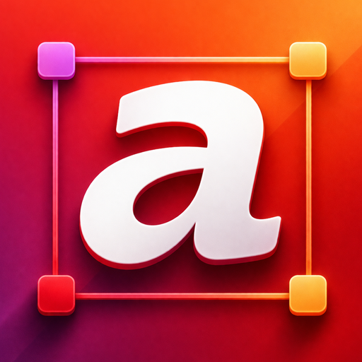
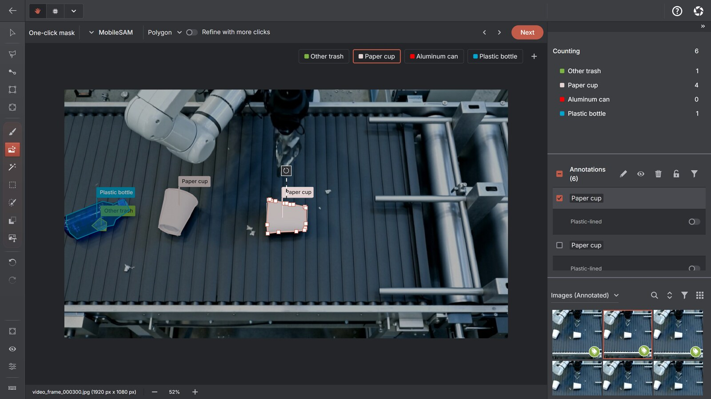

# AnnotateIt Community

**The public issue tracker, support hub and roadmap for AnnotateIt AI.**

[Website](https://annotateit.ai/) ·
[Open the web app](https://app.annotateit.ai/) ·
[Try a demo project](https://app.annotateit.ai/demos) ·
[Documentation](https://app.annotateit.ai/docs) ·
[Download](https://annotateit.ai/download/)

AnnotateIt is a proprietary, local-first application for annotating image and video datasets on Web, Windows, macOS, iPhone and iPad. This repository does not contain the application source code. It gives bugs, requests and public product information one structured, searchable home.

## Current product at a glance

- Projects for object detection, instance segmentation, keypoint detection and single-label, multi-label or hierarchical classification
- Image annotation plus video tracks with keyframes, shape interpolation and stable object identities
- On-device MobileSAM, SAM 2.1, SAM 3 Tracker, CLIP, SigLIP 2, Grounding DINO and RTMPose engines
- Semantic search, Visual Prompt, batch pre-labelling and a review queue
- Experimental custom ONNX import for compatible YOLOv8 detection, segmentation and pose models, RT-DETR, DETR and image classifiers
- Local dataset versions, quality scans, deterministic train/validation/test splits, activity history and portable backups
- COCO, YOLO, Pascal VOC and Datumaro imports, plus task-specific exports to those formats and MOT, MOTS, KITTI, Supervisely Video or Plain ZIP

The web app downloads application and model files but does not upload your datasets. Native builds bundle the default engines. The optional Ask AI chat is the only feature that sends content to a third party, and it stays disabled until you add your own OpenAI API key; see the [privacy information](https://annotateit.ai/privacy/) for the exact boundary.

## Use this repository to

- Report reproducible product bugs
- Request product improvements
- Report import and export compatibility problems
- Follow the public roadmap
- Suggest corrections to public community documents and issue forms

Everything published here is public and indexable. Keep datasets, user media, annotations, credentials, personal information and confidential material out of issues and pull requests.

## Choose the right channel

| Need | Channel |
| --- | --- |
| Bug | [Bug report form](https://github.com/AnnotateIt-AI/annotateit-community/issues/new?template=bug.yml) |
| Feature idea | [Feature request form](https://github.com/AnnotateIt-AI/annotateit-community/issues/new?template=feature.yml) |
| Import/export issue | [Import/export form](https://github.com/AnnotateIt-AI/annotateit-community/issues/new?template=import-export.yml) |
| Product usage question | [Documentation](https://app.annotateit.ai/docs) or email umno.annotateit@gmail.com |
| Security vulnerability | Private email only — see below |
| Privacy request | Email umno.annotateit@gmail.com |

**Security:** do not disclose vulnerabilities in a public issue. Follow the [security policy](https://annotateit.ai/legal/security/) and email umno.annotateit@gmail.com with “Security report” in the subject.

## Before opening an issue

- Search the [existing issues](https://github.com/AnnotateIt-AI/annotateit-community/issues?q=is%3Aissue) to see whether the problem or idea is already tracked.
- Check the [documentation](https://app.annotateit.ai/docs), including the format and platform-difference pages.
- Reproduce the problem on a current build where practical, and include the exact version or build shown by the app.
- Remove private and personal information before posting.
- Use a minimal synthetic or redacted sample if the issue needs sample data.

A report that someone else can follow step by step is more useful than a detailed description of a problem nobody can reproduce.

## Product resources

- Website: <https://annotateit.ai/>
- Web app: <https://app.annotateit.ai/>
- Demo projects: <https://app.annotateit.ai/demos>
- Documentation: <https://app.annotateit.ai/docs>
- Download: <https://annotateit.ai/download/>
- Pricing: <https://annotateit.ai/pricing/>
- Web app changelog: <https://annotateit.ai/changelog/>
- Public roadmap: [ROADMAP.md](ROADMAP.md)
- Platform differences: <https://annotateit.ai/docs/platform-differences/>
- Support policy: <https://annotateit.ai/legal/support/>
- Security policy: <https://annotateit.ai/legal/security/>
- Privacy policy: <https://annotateit.ai/legal/privacy/>
- Organization profile and shared policies: <https://github.com/AnnotateIt-AI/.github>

## Data and privacy

Issues, comments and pull requests in this repository are public and indexable. **Do not post:**

- Private datasets or user images and video
- Confidential annotations or class names
- OpenAI API keys, local REST API access tokens or other credentials
- Licence data
- Unredacted local file paths or full system logs
- Personal information

If demonstrating a problem genuinely requires sample data, use a minimal synthetic or redacted sample. If that is not possible, email umno.annotateit@gmail.com and agree on a safe way to share it first. Content that exposes private or personal data may be removed.

## Source code and contributions

- The AnnotateIt application source is proprietary and is not hosted in this repository or elsewhere in this organization.
- Pull requests here may change public documents, issue templates and community configuration only.
- Application changes are made by the AnnotateIt team in the private codebase; describe the needed change in an issue.
- A feature request is not a commitment, and roadmap items are not promises or delivery dates.

See [CONTRIBUTING.md](CONTRIBUTING.md) for accepted changes and [CODE_OF_CONDUCT.md](CODE_OF_CONDUCT.md) for the standards expected of everyone taking part.
